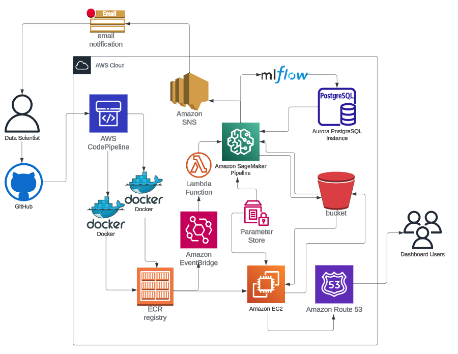

# Premier League Predictions App

**Dashboard is Currently Down due to there being no Premier League Fixtures yet!**

## Description
This app provides predictive analysis of upcoming Premier League football matches based on historical data and statistical modeling.

## Features
- Predict match outcomes with statistical accuracy.
- Visualise past results and team performance.
- Understand the reasons behind predicitons.

## Installation

To set up the project environment:

```bash
git clone https://github.com/davidmarshall196/premier-league-app.git
cd premier-league-predictions-app
pip install -r requirements.txt
```
## Usage
The app is running on Streamlit Community Cloud at https://premier-league-predictor.streamlit.app/

## Data Sources
- Historical results from https://www.football-data.co.uk
- Upcoming fixtures from https://fixturedownload.com
- League table from https://www.footballwebpages.co.uk

## Models
The app uses [Catboost](https://catboost.ai/) for the underlying predictions. There are models for:
- Full time result
- Home Team Score
- Away Team Score

## MLOps Features
- Data validation with Great Expectations and Data Drift detection with Evidently
- Email notifications via SNS when failures occur
- Functional code with doc strings, type hints, exception handling and unit tests
- Black and flake8 for code quality and linting checks
- Training of models and management with MLFlow with a PostgresDB at the backend
- Storing of models, data and logs in S3
- AWS parameter store for secrets and API keys
- Docker images stored in ECR for training pipeline runs and streamlit app
- Eventbridge and Lambda to trigger SageMaker pipeline training jobs

## Deployment
The deployment architecture is shown below. Note that the pipeline is working but that the app is currently deployed on the streamlit community cloud because it's free.



## System Architecture Overview

The diagram illustrates an automated, containerised workflow deployed on AWS, showing the interaction between various services.

### Components

- **Data Scientist**: Initiates the ML workflow by pushing code changes to the source repository.
- **GitHub**: Serves as the source control system where the data scientist commits the code.
- **AWS CodePipeline**: Automatically triggers a continuous integration/continuous deployment (CI/CD) pipeline in response to changes in the GitHub repository.
- **Docker**: Utilised for creating containerised applications for the streamlit app and sagemaker pipline.
- **Amazon ECR (Elastic Container Registry)**: Stores Docker container images which are built by the CI/CD pipeline.
- **Amazon EventBridge**: Used to trigger a weekly cron job for refreshing the pipeline.
- **Lambda**: Used to trigger the SageMaker Pipeline.
- **Amazon EC2 (Elastic Compute Cloud)**: Hosts the application or the ML model on virtual servers in the cloud.
- **Amazon Route 53**: A Domain Name System (DNS) web service, which maps the domain name to the EC2 instance address.
- **Amazon SNS (Simple Notification Service)**: Manages the sending of notifications related to data validation and data drift changes.
- **Amazon SageMaker Pipeline**: Runs on a weekly job to update the models and underlying data.
- **Parameter Store**: Part of AWS Systems Manager, used to manage configuration data and secrets.
- **Aurora PostgreSQL Instance**: A relational database used to store and manage the ML model's data and logs via mlflow.
- **Amazon S3 (Simple Storage Service)**: Storage for all data, models and logs.
- **MLflow**: An open-source platform for the complete ML lifecycle.
